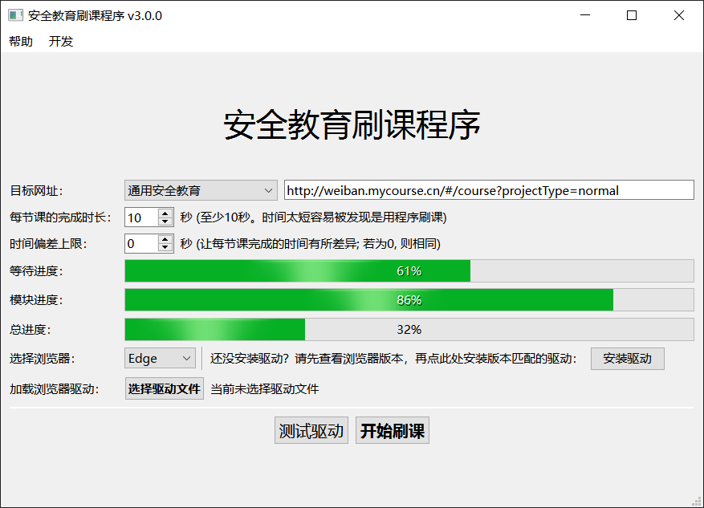

# ScriptForSafetyEducation

> 用python全自动刷课——(北京麦课)安全课程-安全教育学习

LICENCE：`GPL-3.0`

| 平台   | 地址                                                 |
| ------ | ---------------------------------------------------- |
| GitHub | https://github.com/laorange/ScriptForSafetyEducation |
| Gitee  | https://gitee.com/laorange/ScriptForSafetyEducation  |

| B站视频                                                      |
| ------------------------------------------------------------ |
| ▶ [第一期：用python全自动刷课_新生安全教育丨v1.0](https://www.bilibili.com/video/BV1UL411t7CR) |
| ▶ [第二期：基于selenium的全自动python刷网课程序丨安全课程丨 selenium介绍丨v2.0](https://www.bilibili.com/video/BV1TL411c7mt) |
| ▶ [第三期：python图形界面 PyQt/PySide6 QtDesigner的使用](https://www.bilibili.com/video/BV1Wa41127fk) |
| ▶ [第四期：Python图形界面 15分钟快速入门PySide/PyQt 信号与槽](https://www.bilibili.com/video/BV18F411W7y2) |

## 截图



## 第三方库

```python
# pip install -r requirements.txt
PySide6>=6.2.2
loguru>=0.5.3
selenium>=4.1.0
```

## 支持刷以下课程：

### · 新生安全教育 

+ `http://weiban.mycourse.cn/#/course?projectType=pre` 

  

### · 安全课程学习 

+ `http://weiban.mycourse.cn/#/course?projectType=normal` 

  
  
### · 专题学习 

+ `http://weiban.mycourse.cn/#/course?projectType=special` 

  

## ⚠请注意⚠

1. 该学习的课程请自行学习。

2. 写本程序是因为我想学`selenium`，并做一个项目练手。

3. 开源仅用于学习交流，严禁商用！
4. 如果不着急，每节课的间隔时长可以设置在1分钟以上，尽量与正常看课时间接近，这样会非常安全。

4. 使用该程序导致的任何后果请由使用者自行承担。
